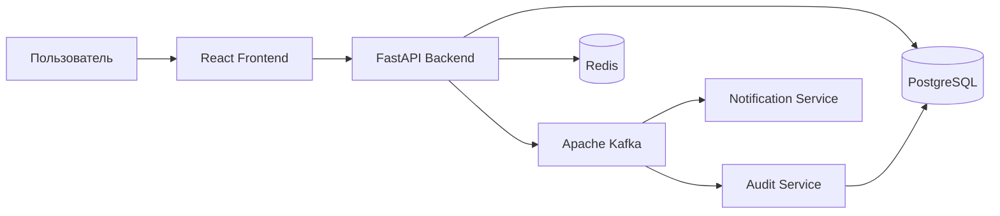
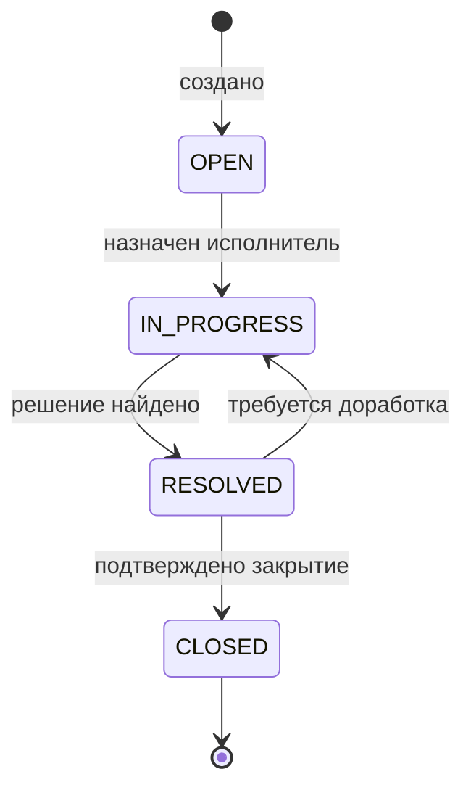

# Архитектура системы

## Общий вид

## Компоненты

### Frontend

React-приложение предоставляет интерфейс для входа, просмотра статистики, создания обращений и администрирования тикетов.

### Backend API

Основной сервис на FastAPI. Отвечает за:

- регистрацию и вход;
- JWT-аутентификацию;
- ролевую авторизацию;
- работу с обращениями и сообщениями;
- публикацию доменных событий;
- кэширование статистики.

### PostgreSQL

Основное хранилище данных: пользователи, обращения, сообщения и журнал аудита.

### Redis

Используется для хранения временных данных и кэширования часто запрашиваемой статистики по обращениям.

### Apache Kafka

Брокер событий. Backend публикует события `ticket.created`, `ticket.updated`, `ticket.assigned`, `message.created`. Отдельные сервисы подписываются на эти события.

### Notification Service

Сервис асинхронной обработки событий. Формирует персональные уведомления, сохраняет их в PostgreSQL и делает доступными через API.

### Audit Service

Сервис централизованного журналирования. Получает события из Kafka и сохраняет их в таблицу `audit_logs`.

## Жизненный цикл обращения

Недопустимые переходы блокируются на уровне backend API. Закрытое обращение считается терминальным состоянием: оно не принимает новые сообщения и не переназначается.

## Контроль доступа

- `USER` видит только созданные им обращения.
- `AGENT` видит только назначенные ему обращения, меняет их статусы и переписывается с клиентом.
- `SUPER_ADMIN` видит все обращения, назначает исполнителей, управляет ролями и просматривает аудит.
- Исполнителем может быть только активный пользователь с ролью `AGENT`.
- Суперадминистратор не участвует в клиентской переписке.
- Добавлять сообщения могут автор обращения и назначенный исполнитель.
- Добавление сообщений в закрытый тикет запрещено.
