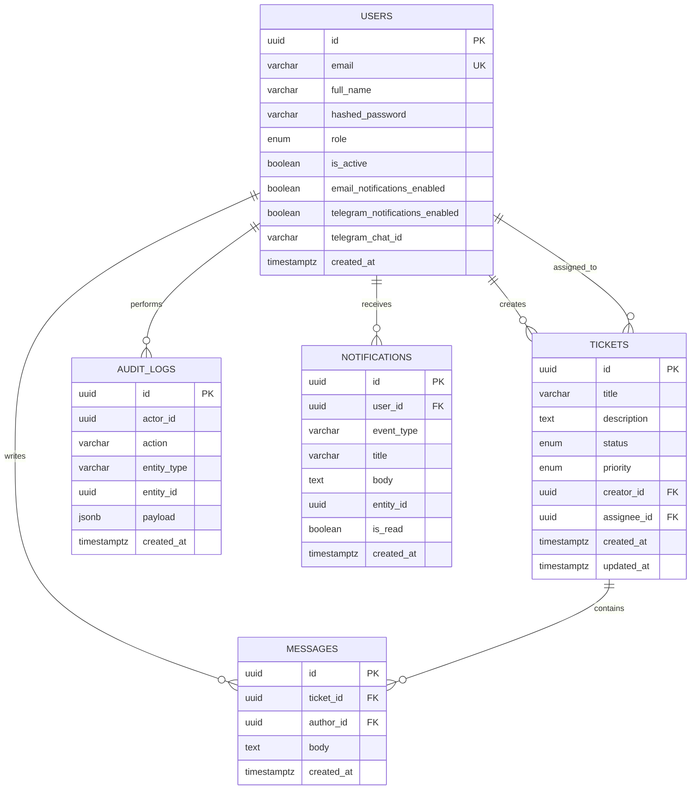

# ER-диаграмма и структура БД

## ER-диаграмма

## Таблица `users`

Хранит учётные записи пользователей.

- `id` — уникальный идентификатор;
- `email` — уникальный email для входа;
- `full_name` — имя пользователя;
- `hashed_password` — хэш пароля;
- `role` — роль `SUPER_ADMIN`, `AGENT` или `USER`;
- `is_active` — признак активности;
- `email_notifications_enabled` — согласие на получение email-уведомлений;
- `telegram_notifications_enabled` — согласие на получение Telegram-уведомлений;
- `telegram_chat_id` — идентификатор чата Telegram для отправки сообщений ботом;
- `created_at` — дата создания.

## Таблица `tickets`

Хранит обращения клиентов.

- `id` — уникальный идентификатор;
- `title` — тема обращения;
- `description` — описание проблемы;
- `status` — `OPEN`, `IN_PROGRESS`, `RESOLVED`, `CLOSED`;
- `priority` — `LOW`, `MEDIUM`, `HIGH`, `CRITICAL`;
- `creator_id` — автор обращения;
- `assignee_id` — назначенный исполнитель;
- `created_at`, `updated_at` — даты создания и изменения.

## Таблица `messages`

Хранит переписку внутри обращения.

- `id` — уникальный идентификатор;
- `ticket_id` — обращение;
- `author_id` — автор сообщения;
- `body` — текст сообщения;
- `created_at` — дата отправки.

## Таблица `audit_logs`

Хранит централизованный журнал действий.

- `id` — уникальный идентификатор;
- `actor_id` — пользователь, совершивший действие;
- `action` — тип действия;
- `entity_type` — тип сущности;
- `entity_id` — идентификатор сущности;
- `payload` — дополнительные данные события;
- `created_at` — дата записи.

## Таблица `notifications`

Хранит персональные уведомления, созданные Notification Service после обработки Kafka-событий.

- `user_id` — получатель;
- `event_type` — тип исходного события;
- `title`, `body` — содержимое уведомления;
- `entity_id` — связанное обращение;
- `is_read` — признак прочтения.
